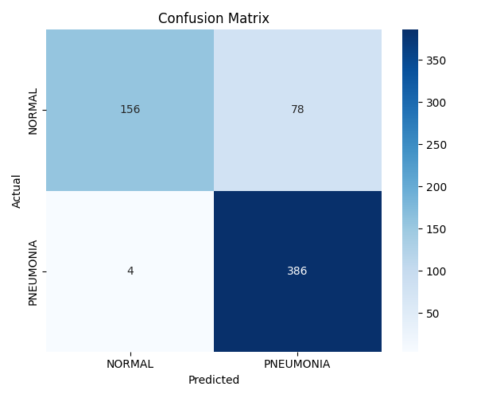
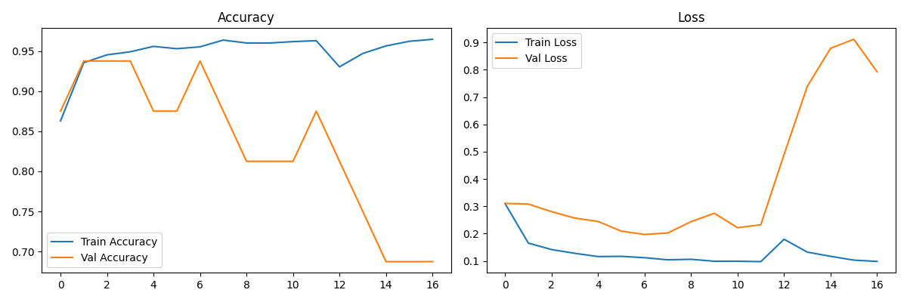

# PneumoScan — Medical Image Classification System (Chest X-Ray Pneumonia Detection) 🩺🧠

A transfer-learning based image classification system for detecting diseases from medical images (X-ray / MRI / skin lesion) using **MobileNetV2** and TensorFlow/Keras.

## 📌 Overview

This project classifies medical images into disease categories using a fine-tuned CNN. It was built to demonstrate an end-to-end deep learning pipeline — from data preprocessing and augmentation to model training, evaluation, and inference.

**Example use case:** Pneumonia detection from Chest X-Ray images (Normal vs Pneumonia).

## 🎯 Features

- Transfer learning with pretrained **MobileNetV2** (ImageNet weights)
- Two-phase training: feature extraction + fine-tuning
- Data augmentation (rotation, zoom, flip) to reduce overfitting
- Automatic evaluation: accuracy, classification report, confusion matrix
- Training curve visualizations
- Ready-to-use single-image prediction function

## 🗂️ Dataset

This project is designed to work with any labeled medical image dataset structured as:

```
dataset/
    train/
        class1/
        class2/
    val/
        class1/
        class2/
    test/
        class1/
        class2/
```

**Dataset used:** [Chest X-Ray Pneumonia Dataset (Kaggle)](https://www.kaggle.com/datasets/paultimothymooney/chest-xray-pneumonia)

Other compatible datasets:
- [Brain Tumor MRI Dataset](https://www.kaggle.com/datasets/masoudnickparvar/brain-tumor-mri-dataset)
- [Skin Cancer HAM10000](https://www.kaggle.com/datasets/kmader/skin-cancer-mnist-ham10000)
- [COVID-19 Radiography Database](https://www.kaggle.com/datasets/tawsifurrahman/covid19-radiography-database)

## 🛠️ Tech Stack

- Python
- TensorFlow / Keras
- MobileNetV2 (Transfer Learning)
- NumPy, Matplotlib, Seaborn
- Scikit-learn

## 🚀 How to Run

1. Clone this repository:
```bash
git clone https://github.com/<your-username>/medical-image-classification.git
cd medical-image-classification
```

2. Install dependencies:
```bash
pip install -r requirements.txt
```

3. Download the dataset and organize it into `dataset/train`, `dataset/val`, `dataset/test` folders.

4. Run training:
```bash
python medical_image_classifier.py
```

## 📊 Results

Trained on the Chest X-Ray Pneumonia dataset using MobileNetV2 transfer learning (feature extraction + fine-tuning).

| Metric | Score |
|--------|-------|
| Test Accuracy | **87%** |
| Precision (weighted avg) | 0.89 |
| Recall (weighted avg) | 0.87 |
| F1-Score (weighted avg) | 0.86 |

**Per-class breakdown:**

| Class | Precision | Recall | F1-Score |
|-------|-----------|--------|----------|
| Normal | 0.97 | 0.67 | 0.79 |
| Pneumonia | 0.83 | 0.99 | 0.90 |

### Confusion Matrix


### Training Curves


**Notes:** The model detects Pneumonia cases very reliably (99% recall) but is more conservative on Normal cases (67% recall), meaning it sometimes flags a healthy X-ray as Pneumonia rather than the reverse — a reasonable trade-off for a screening tool where missing a real case is costlier than a false alarm. `EarlyStopping` with `restore_best_weights` was used, so the saved model reflects the best validation performance rather than the final epoch.

## 🔮 Future Improvements

- Deploy as a web app using Streamlit/Flask
- Add Grad-CAM visualization for model explainability
- Experiment with other architectures (EfficientNet, ResNet)
- Expand to multi-disease classification

## 📄 License

This project is open-source and available under the MIT License.

## 🙋 Author

**[Abdur Rauf Shah]**
[LinkedIn](https://www.linkedin.com/in/abdur-rauf-shah/) | [GitHub](https://github.com/AbdurRaufShah) | [Email](abdurraufhashmi@gmail.com)
